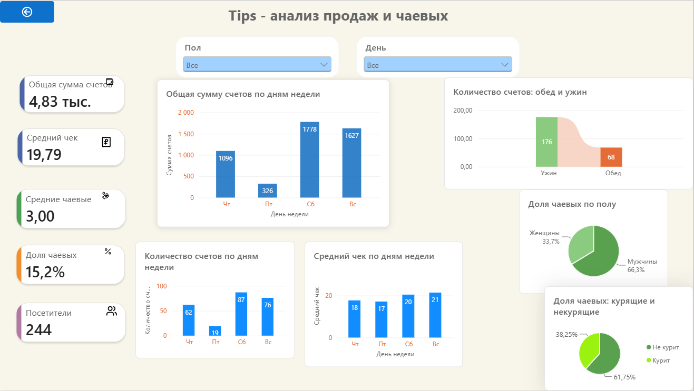

# Power BI Dashboard — Tips Dataset

Интерактивный дашборд по данным о счетах и чаевых в ресторане.

## О проекте

Дашборд создан на основе датасета `tips` и предназначен для анализа структуры счетов, чаевых и поведения посетителей.

В проекте представлены:

* общая сумма счетов;
* средний чек;
* средние чаевые;
* средний процент чаевых;
* количество посетителей;
* анализ суммы счетов по дням недели;
* анализ количества счетов по дням недели;
* анализ среднего чека по дням недели;
* распределение чаевых между курящими и некурящими посетителями;
* распределение чаевых по полу;
* количество счетов в зависимости от времени суток.

Для интерактивного анализа используются срезы по полу и дню недели.

## Инструменты

* **Power BI**
* **Power Query**
* **DAX**

## Дашборд

## Файлы проекта

* `tips_dashboard.pbix` — файл Power BI с интерактивным дашбордом.
* `dashboard.png` — изображение готового дашборда.
